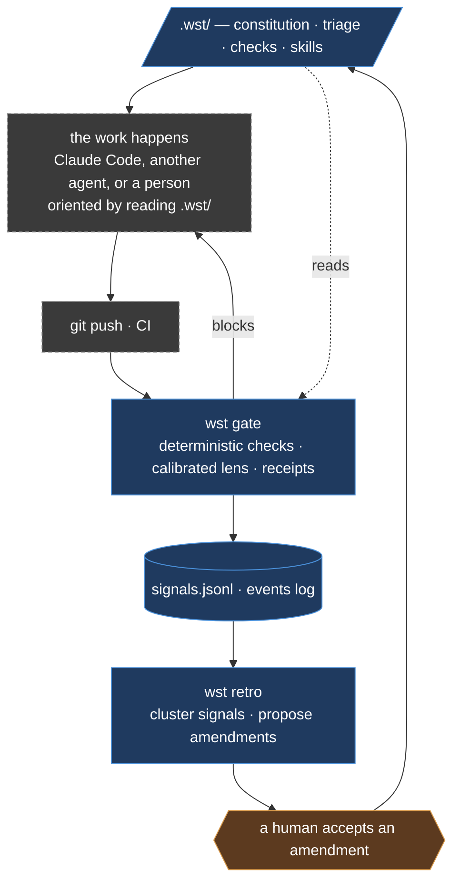

# Architecture

What Whetstone is and how it is built, in the present tense. This page never argues a decision
and holds no history: the alternatives that were ruled out are in `.wst/memory/decisions.md`,
the rest is in git. Where this page and any other document disagree, this one is authoritative
and the other is drift.

## Three parts

- **`.wst/` = DATA.** The constitution, the triage rules, the check registry, the skills, the
  memory. Plain files, versioned in git, per project. Vendor-neutral: `CLAUDE.md`, `AGENTS.md`
  and `.claude/**` are rendered FROM it.
- **The engine = CODE, deterministic.** Reads `.wst/`, classifies a change by glob, selects
  checks, runs them, enforces the gate, writes receipts and events, records signals, clusters a
  retro.
- **The LLM = judgment only.** `llm` checks, and proposing a new check. `src/core/`
  never calls one.

| Deterministic — the engine | LLM — judgment only |
|---|---|
| triage classification · check selection · running deterministic checks · enforcing the gate · receipt hashing · the event log · signal collection and clustering · emitting hooks | `llm` checks · proposing a new check (human-gated) |

Frugality is about VERIFICATION, not execution. The agent doing the work costs what it costs;
Whetstone verifies frugally, triage-gated.

## The loop



**Whetstone** (solid blue) owns the definition, the prediction, the charter, the gate, the log
and the retro. **The harness** (dashed grey) owns execution and transport: the agent or person
who writes the code, git, the forge, CI. **A human** (amber) signs twice — once on the plan,
once on any amendment to the rules. Neither signature is automatable; `wst retro` proposes and
never applies, and `wst signal` is a command for a person to type.

The boundary in one line: **Whetstone decides whether work is acceptable; the harness produces
it.** Whetstone leases worktrees through treehouse, talks to GitHub through `gh`, and executes
and judges through `claude`. It is not a fleet manager, not a spec framework, not a memory
server.

## The commands

| | |
|---|---|
| `wst status` | repo, `.wst/`, judge health, version drift, whether the pre-push gate is armed |
| `wst check` | list the registry; refuses to load an uncalibrated blocking lens |
| `wst triage` | classify a diff → tier → which checks apply |
| `wst gate` | run the checks, skip what receipts prove unchanged, pass or block, emit signals and events |
| `wst events` | read the log `gate` writes: a run's timeline, per-check duration, how it ended. Writes nothing |
| `wst signal` | record an observation in `memory/signals.jsonl`. For a human to type |
| `wst retro` | cluster signals, propose rule changes, never apply them |
| `wst init` | interview a repo and generate its `.wst/` |

Flags that change what runs: `gate --no-lens` (deterministic only — what the pre-push hook
runs) · `gate --no-emit` (record no signals; for verifying the gate itself) · `gate --tier` ·
`prepare --dry-run` · `retro --dry-run` · `plan --json` · `events --list` · `events --follow`.

## The layers

These are the six **product** stages, numbered by when they happen to a change. The code
has its own dependency depth — seven levels of imports — and the two do not line up.
When this page says "layer" it means a stage below, never an import level.

| # | Stage | What it does |
|---|---|---|
| 0 | **Definition** — `.wst/` | Per-project source of truth: constitution, triage rules, check registry, skills, memory |
| 1 | **Apply** — `wst init` | Interview a repo, generate its `.wst/`. Reads declared facts; asks about everything else |
| 2 | **Triage** | Classify a change by glob → tier → which checks run |
| 3 | **Execution seam** | Nothing. A worker orients itself by reading `.wst/`, which travels with the repo. Whetstone does not brief, dispatch or execute (ADR-0023) |
| 4 | **Verification gate** | Deterministic checks always, a calibrated lens when the tier earns it. Receipts skip what already passed |
| 5 | **Self-sharpening** — `wst retro` | Signals → clusters → proposed amendments → a human accepts → `.wst/` changes |

Cross-cutting: **memory** (`.wst/memory/`, files backend), **receipts** (skip re-work, audit,
tamper-guard) and the **event log** (what a run did, while it runs).

## FCIS — functional core, imperative shell

```
src/
  cli.ts              commander wiring only, zero logic
  commands/           composition roots: build adapters, call core, print
  core/               PURE. no I/O, no LLM. MUST NOT import from shell/
    ports.ts          Git · Clock · LlmJudge interfaces
    paths.ts          the one owner of the definition directory's name
    triage/           globs → tier → routing
    checks/           registry loading, the check schema
    gate/             selection, chunking, running, aggregation, reporting
    plan/             parse a plan, preview what judges it
    diff/             raw diff text → changed files + content hashes
    llm/verdict.ts    validate an envelope → accept | retry | fail
    calibration/      receipts that grant a lens its blocking authority
    receipts/ events/ signals/ retro/ init/ dispatch/ status/ history/
    orchestrate/      policy that drives ports passed AS PARAMETERS
  shell/              IMPERATIVE. thin adapters: git, claude, treehouse, sdd,
                      signals, events, receipts, calibration, retro, jsonl, plugin
```

Nothing under `core/` imports from `shell/`, and nothing under `core/` calls an LLM. Both are
enforced by `test/architecture.test.ts`. Mock `LlmJudge` and the core is fully unit-testable.

The import guard enforces direction. What keeps judgment out of the untested layer is
`orchestrate/`: orchestrators receive ports as parameters, so retry and sequencing policy has a
home in `core/` instead of accreting in `commands/`, which nothing guards.

## The check registry

One file per check in `.wst/checks/`, YAML frontmatter plus prose. `id`, `kind`
(`deterministic` | `llm`), `severity` (`block` | `warn` | `annotate`), `tiers`,
`include`/`exclude` globs, `command` or `review_lens`, `origin`, `version`.

**A judgment check earns its `block` at parse time.** An `llm` declaring
`severity: block` without a passing calibration receipt does not load. Authority comes from
`<id>.calibration.json`, whose hashes the loader recomputes — not from a hand-typed field. The
bar is 10/10 correct and unanimous on a known-good and a known-bad fixture, zero flips.
Deterministic checks block freely.

**Only a real check failure blocks.** A check that could not RUN — spawn, budget, timeout,
auth, invalid output — is the gate being broken and reports `errored`. A run that verified
nothing is not a pass, and "no checks ran" never shares a message with "all checks passed".

Include globs are matched with `node:path`'s `matchesGlob` against repo-relative paths. `**`
does not cross a dot-leading segment, so a path under `.wst/` names it explicitly.

## The judge

One port, `LlmJudge`. Agnosticism is multiple adapters behind it, and `agent:` in `wst.yaml`
selects one — read by `shell/judge.ts`, which is the only place that names a vendor.
The core never knows the model. Today one adapter ships: `shell/claude.ts`, which shells out to
`claude -p` and uses the Max subscription rather than an API key.

**The invocation is hermetic, and every flag was measured. Do not simplify it.**

```
claude -p --output-format json --json-schema '<schema>' --append-system-prompt '<lens>' \
  --strict-mcp-config --mcp-config '{"mcpServers":{}}' \
  --settings '{"hooks":{},"outputStyle":"default"}' \
  --tools "" --model <haiku|sonnet|opus> [--max-budget-usd N]
```

The prompt goes on **stdin** — diffs exceed argv limits.

- **Hermeticity is what makes the judge trustworthy and affordable.** The flags strip the
  target repo's MCP servers, hooks, plugins, skills and output styles, so a repo cannot tell
  its own reviewer what to think of it. They also cut a one-word answer from 140,682 tokens
  and $0.84 to ~11.4k and $0.03–0.08.
- **Everything the judge must read is inlined.** A hermetic judge has no tools and cannot
  resolve a path.
- **`--append-system-prompt`, never `--system-prompt`.** Replacing the system prompt corrupts
  structured output.
- **Never `--bare`.** It forces an API key and never reads OAuth.
- **`--json-schema` validates natively**, and the envelope carries `total_cost_usd`, token
  counts and `duration_ms`. Validation is necessary, not sufficient: a payload can be
  schema-valid and unusable, so retry stays.
- **Trailing markup is sanitised; markup in the middle fails closed.** `core/llm/verdict.ts`
  strips a well-formed trailing suffix and reports it via `sanitized`. Contamination is
  size-correlated: 0/40 on diffs under 10 lines, 13/40 at 11–15 lines.
- **`stream-json` requires `--verbose`.** We use `json`.

## Where state lives

| Path | What |
|---|---|
| `.wst/memory/decisions.md` | Every decision, by anchor id. What was ruled out, and why |
| `.wst/memory/signals.jsonl` | Append-only observations. The retro's input |
| `.wst/memory/retro-log.md` | What a retro concluded. A proposal under `proposals/` is transient — deleted once the log records the decision (adr-0017) |
| `.wst/memory/out-of-scope/` | What was deliberately refused, so it is not re-proposed |
| `.wst/checks/*.calibration.json` | The receipt that grants a lens blocking authority |
| `docs/lanes.yaml` | Lane ownership. `.claude/hooks/lane-guard.mjs` is compiled from it |
| `.githooks/pre-push` · `.github/workflows/gate.yml` | Where the gate actually runs |
| `.claude/` | Emitter output, compiled from `.wst/`. A hand-edit here is drift |
